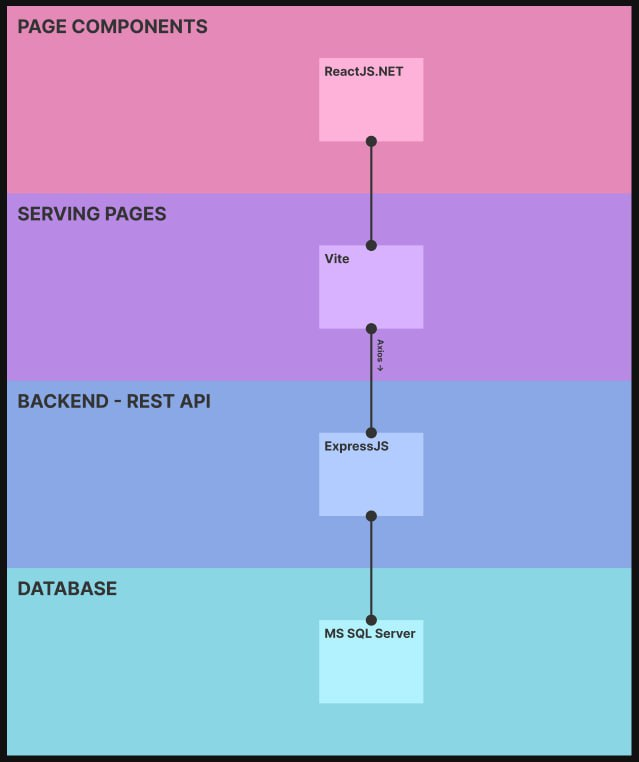

# Logical Software Architecture

The **Warehouse Management System (WMS) Architecture** is designed with a **layered approach** to ensure scalability, maintainability, and efficient data flow. The system follows a **modern web-based architecture**, using **ReactJS.NET** for the front-end, **Vite** for serving pages, **ExpressJS** for the backend API, and **MS SQL Server** as the database.

---

## **1. System Architecture Overview**
The system is divided into **four primary layers**:  
1. **Page Components (Frontend UI)** - User interface built with **ReactJS.NET**.  
2. **Serving Pages (Static Hosting & Bundling)** - Uses **Vite** for fast page rendering.  
3. **Backend REST API** - **ExpressJS** handles communication between frontend and database.  
4. **Database Layer** - **MS SQL Server** stores all warehouse-related data.  

Below is the architecture diagram illustrating the structure:

---

## **2. Layer Breakdown**
### **2.1 Page Components (Frontend)**
- Built using **ReactJS.NET**, allowing for component-based UI development.
- Ensures a **responsive, interactive, and efficient user experience**.
- Connects to the backend via **API requests**.

### **2.2 Serving Pages (Vite)**
- Vite is used to serve frontend assets with **optimized build speeds**.
- Handles **hot reloading** during development, improving efficiency.

### **2.3 Backend (ExpressJS - REST API)**
- Implements a **RESTful API** to communicate with the database.
- Manages **business logic, authentication, and user permissions**.
- Ensures **secure and optimized** data access for the frontend.

### **2.4 Database (MS SQL Server)**
- Stores all **inventory, user, and system logs**.
- Maintains **data integrity** with proper foreign key constraints.
- Allows **scalable and fast** querying for warehouse operations.

---

## **3. Architectural Justification**
This architecture was chosen for:  
✅ **Performance** – Vite improves load times; ExpressJS ensures fast API responses.  
✅ **Scalability** – The modular approach allows adding new features with minimal changes.  
✅ **Security** – User authentication and database restrictions prevent unauthorized access.  
✅ **Maintainability** – The separation of concerns between UI, API, and database simplifies debugging and future enhancements.  

---