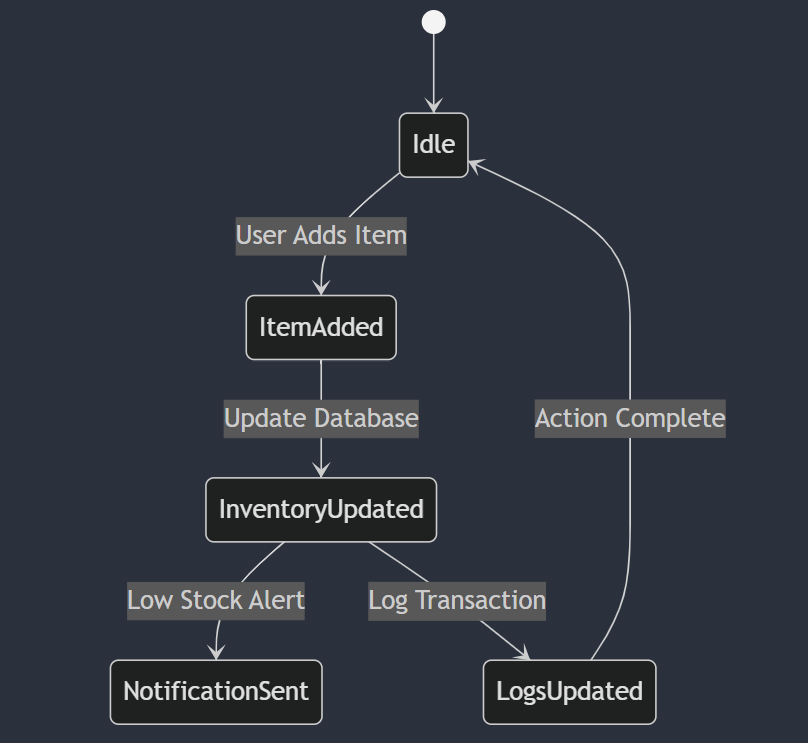
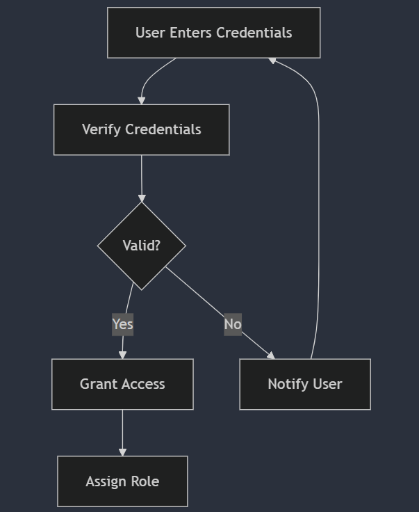
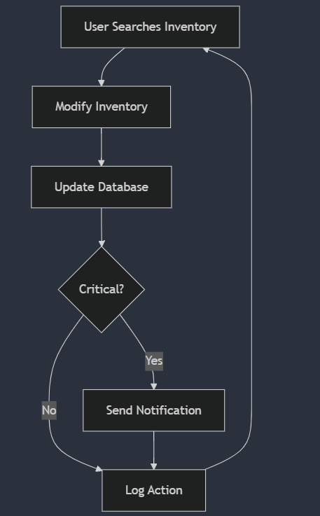
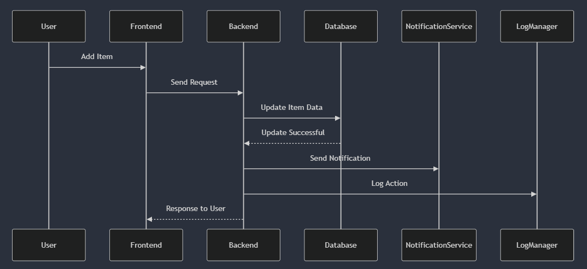

# Business Logic Model

The **Business Logic Model** defines the core operational logic of the **Warehouse Management System (WMS)**. It provides a structured representation of how various processes interact, how data flows between different components, and how the system handles critical events such as inventory updates, user authentication, and item tracking.

Below are the key diagrams that illustrate the business logic of the system.

---

## **State-Machine Diagram**
### **Inventory Update Workflow**
This **state-machine diagram** represents how the system transitions between different states when an item is added to the warehouse. It starts in an **Idle** state, then moves to **ItemAdded** when a user registers a new item. The system updates the inventory database, logs transactions, and triggers notifications when necessary.

---

## **Activity Diagrams**
### **User Authentication Process**
The **user authentication** diagram details how the system verifies user credentials. When a user enters login information, the system checks its validity. If correct, access is granted and roles are assigned. If incorrect, the system notifies the user of invalid credentials.

### **Inventory Management Process**
This diagram illustrates the **inventory management workflow**, which includes searching for an item, modifying inventory data, updating the database, and checking if an item is in a **critical state**. If critical, a notification is sent to relevant personnel.

---

## **Sequence Diagram**
### **Item Adding Sequence**
The **sequence diagram** outlines the interactions between system components when a new item is added. The **user** initiates the process, which flows through the **frontend, backend, database, notification service, and logging system** to ensure proper tracking of inventory updates.

---

This structured approach ensures that the **Warehouse Management System** efficiently handles inventory updates, user authentication, and notification mechanisms, reducing operational bottlenecks and improving system reliability.