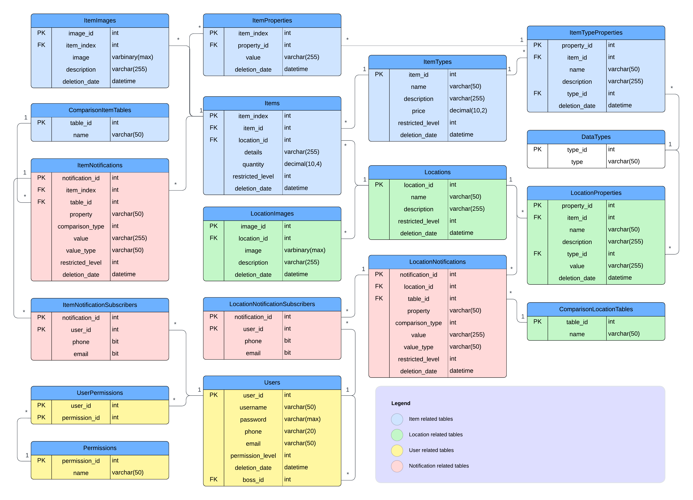

# Database Model

The **Warehouse Management System (WMS) Database Model** is structured to efficiently handle **inventory tracking, user management, location storage, and notification services**. The model ensures that all **items, locations, users, and notifications** are properly managed while maintaining data integrity and scalability.

---

## **1. Overview of the Database Model**
The database is divided into **four primary categories**:  
1. **Item-related tables (Blue)** - These manage items, their properties, and associated images.  
2. **Location-related tables (Green)** - These store details about storage locations and images.  
3. **User-related tables (Yellow)** - These handle user authentication, roles, and permissions.  
4. **Notification-related tables (Red)** - These manage system notifications and their subscriptions.  

Below is the **entity-relationship diagram (ERD)** illustrating the structure:

---

## **2. Key Components**
### **2.1 Item Management**
- **`Items`**: Stores detailed information about each item, including quantity and storage location.
- **`ItemTypes`**: Defines the type, description, and pricing details of items.
- **`ItemProperties`**: Holds additional properties for items such as metadata or special attributes.
- **`ItemImages`**: Links item images to respective items for better visualization.

### **2.2 Location Management**
- **`Locations`**: Stores warehouses and sector information, including restricted storage levels.
- **`LocationProperties`**: Defines attributes for locations.
- **`LocationImages`**: Stores images of different warehouse locations.

### **2.3 User Management**
- **`Users`**: Manages user authentication and permissions.
- **`Permissions`**: Defines roles and access levels.
- **`UserPermissions`**: Maps users to their respective permission levels.

### **2.4 Notifications & Logs**
- **`ItemNotifications` & `LocationNotifications`**: Alerts related to items and locations.
- **`ItemNotificationSubscribers` & `LocationNotificationSubscribers`**: Tracks users who receive notifications.
- **`ComparisonItemTables` & `ComparisonLocationTables`**: Defines comparisons between different items and locations.

---

## **3. Design Rationale**
The database is structured for **scalability, maintainability, and efficiency**:  
- **Normalization**: The tables are properly normalized to **avoid data redundancy**.  
- **Relationships**: Strong **foreign key constraints** ensure data integrity.  
- **Modularity**: The separation of **items, users, locations, and notifications** allows for easier modifications and expansions in future iterations.

---