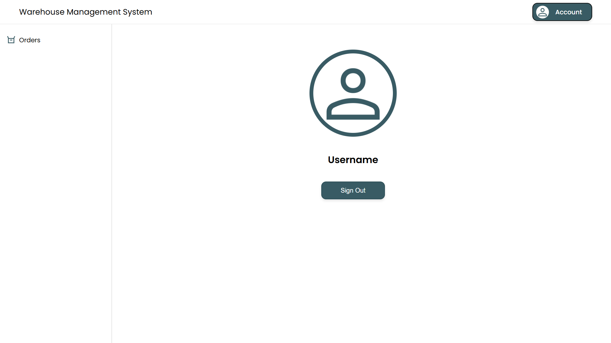
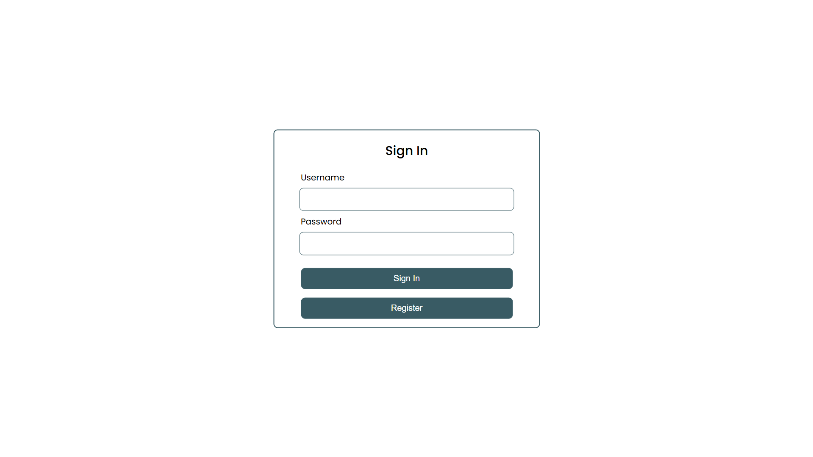
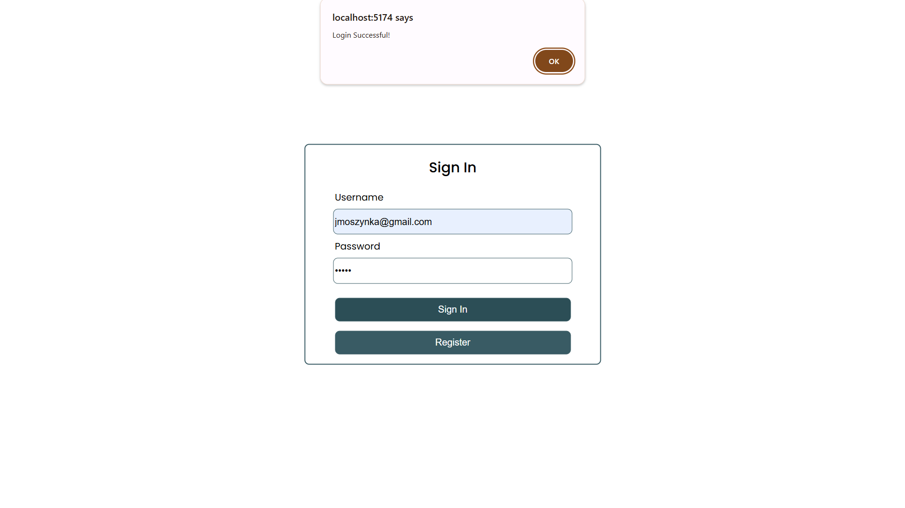
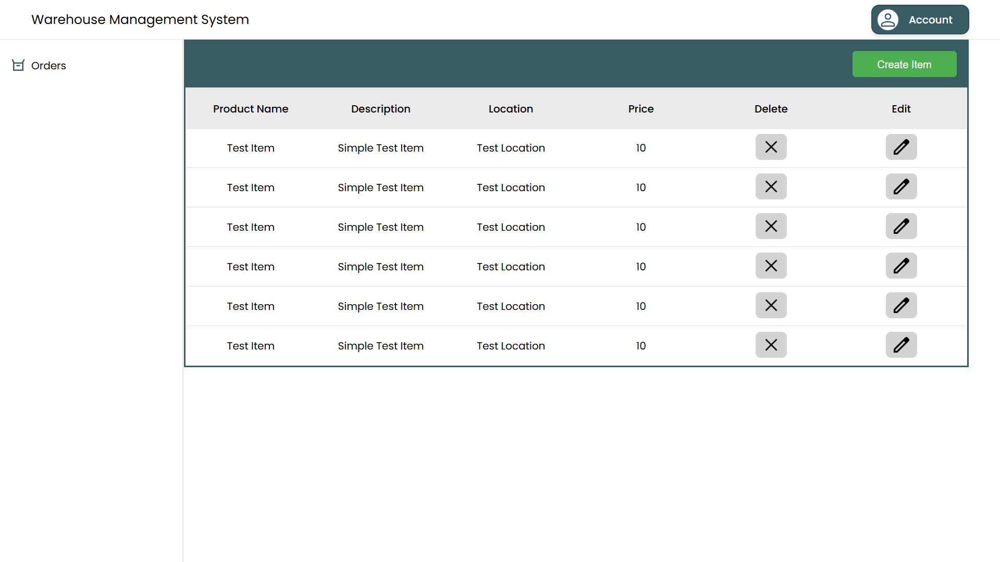
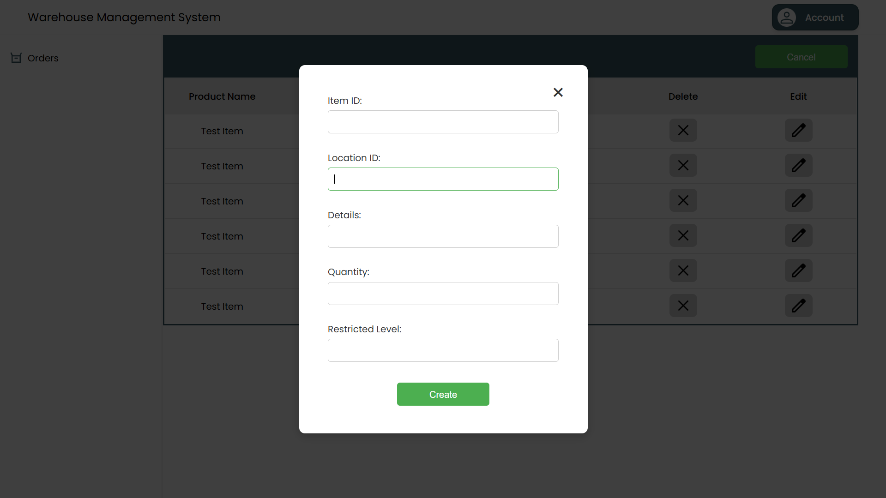

# UI Design

This section outlines the **User Interface (UI) Design** of the Warehouse Management System. The system consists of multiple views, each designed to facilitate user interaction with the platform.

---

## **1. User Dashboard**
The user dashboard provides an overview of the system and allows users to manage their account and navigate through different sections.

**Features:**  
- Displays the logged-in user's profile.  
- Provides a **Sign Out** button for user logout.  
- Navigation menu on the left for quick access to different features.

---

## **2. Login Page**
The login page allows users to enter their credentials and access the system.

**Features:**  
- Input fields for username and password.  
- Buttons for **Sign In** and **Register**.  
- Validation for user authentication.

---

## **3. Successful Login Notification**
Upon successfully logging in, users receive a notification confirming their authentication.

**Features:**  
- Displays a confirmation message when login is successful.  
- Provides an **OK** button to close the notification.

---

## **4. Orders Page**
The orders page allows users to view and manage warehouse inventory.

**Features:**  
- Displays a list of **stored items** with columns for product name, description, location, and price.  
- Provides **Edit** and **Delete** buttons for each item.  
- A **Create Item** button for adding new items.

---

## **5. Insert Item Modal**
The insert item modal allows users to add new items to the warehouse.

**Features:**  
- Input fields for item ID, location ID, details, quantity, and restricted level.  
- A **Create** button to add the item to the system.  
- A close button to cancel the operation.

---