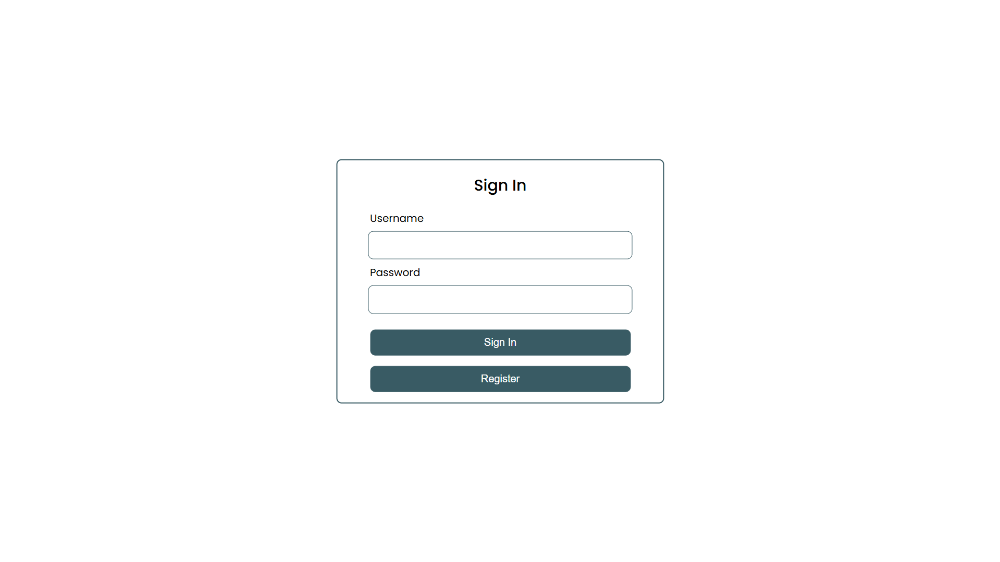

# UI Design

The user interface (UI) of the **Warehouse Management System** has been designed to be intuitive, structured, and efficient for managing inventory, locations, and item types. The system ensures easy navigation and interaction, providing clear options for managing warehouse operations.

---

## **Login Page**
The **Login Page** is the first interaction users have with the system. It provides a minimalistic and clean authentication interface with two input fields for **Username** and **Password**.  
Below the input fields, there are two buttons:  
- **Sign In** – Used to authenticate existing users.  
- **Register** – Allows new users to create an account.

The page maintains a simple and professional look, ensuring users can quickly enter their credentials and access the system.

---

## **User Dashboard**
Upon successful login, users are redirected to the **User Dashboard**, which serves as the central hub for accessing different sections of the system.  
The layout consists of:  
- A **sidebar navigation panel** on the left with options for managing:  
  - **Items**  
  - **Item Types**  
  - **Locations**  
- A large **profile icon** in the center displaying the logged-in username.  
- A **Sign Out** button for logging out securely.

The dashboard ensures quick access to key functionalities while maintaining a structured and distraction-free design.

.png)

---

## **Items Management**
The **Items Management** page is a core section where users can view, create, and manage warehouse items.  
The layout consists of:  
- A **table** displaying all available warehouse items with columns for:  
  - **Item Type**  
  - **Location**  
  - **Details**  
  - **Quantity**  
- A **Create Item** button at the top right, allowing users to add new inventory items.  
- **Edit and Delete** buttons next to each item for modifying or removing them.

This page ensures that users have a structured and efficient way to manage their warehouse inventory.

.png)

---

## **Create Item Modal**
Clicking on the **Create Item** button opens a **modal dialog box**, allowing users to enter details for a new item.  
The form includes:  
- **Item ID** – Unique identifier for the item.  
- **Location ID** – The warehouse location where the item is stored.  
- **Details** – A short description of the item.  
- **Quantity** – The number of items in stock.  
- **Restricted Level** – Indicates if the item has any restrictions.  
- **Choose a Type & Choose a Location** – These buttons allow users to select predefined item types and locations.

The design ensures that item creation is straightforward and efficient.

.png)

---

## **Item Types Management**
The **Item Types** page enables users to categorize different types of inventory.  
The page layout includes:  
- A **table** listing item types with columns for:  
  - **Name**  
  - **Description**  
  - **Price**  
- **Edit and Delete** buttons for modifying or removing an item type.  
- A **Create Item Type** button for adding new categories.

This page helps users define various item types, ensuring efficient classification of warehouse stock.

.png)

---

## **Location Management**
The **Location Management** page provides an interface for tracking and managing warehouse storage locations.  
The layout includes:  
- A **table** displaying all locations, with columns for:  
  - **Name** – The name of the location.  
  - **Description** – A brief detail about the storage area.  
- **Edit and Delete** buttons to modify or remove locations.  
- A **Create Location** button for adding new warehouse locations.

The UI ensures that users can quickly assign and manage storage areas for better organization.

.png)

---