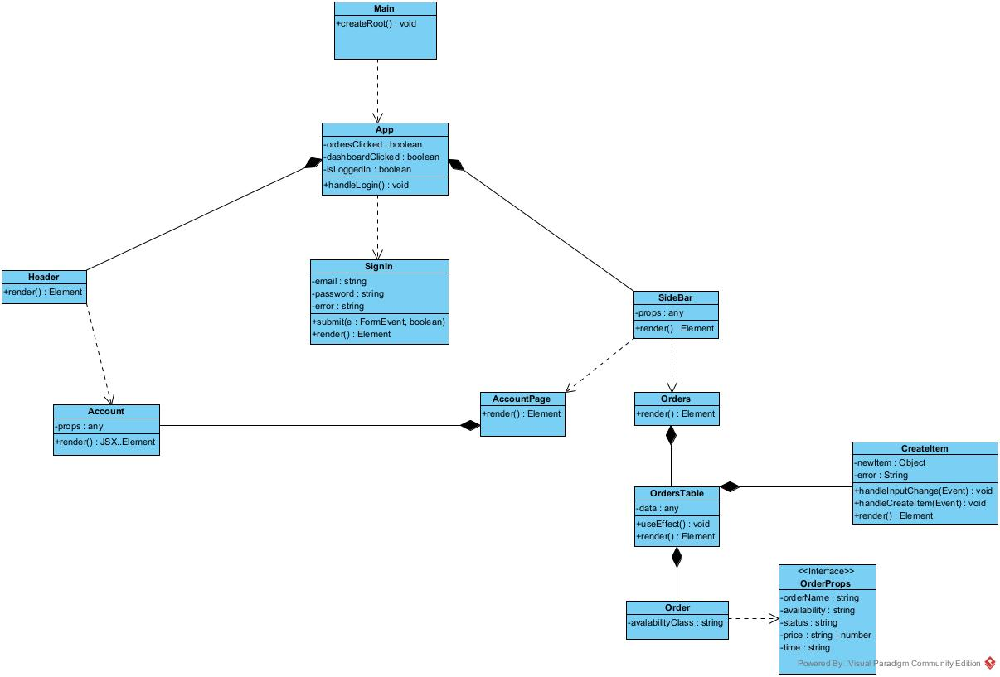

# UML Diagram

This section provides an overview of the **UML Class Diagram** for the Warehouse Management System's frontend architecture. The diagram represents the relationships between different components, their attributes, and the main interactions in the application.

## Class Diagram Overview

The UML Class Diagram illustrates the core structure of the **React-based frontend**, showing the hierarchy of components and how they interact within the system.

- **Main Component (`Main`)**: Responsible for rendering the root of the application.
- **App Component (`App`)**: Manages application-wide states like login status and navigation.
- **Authentication (`SignIn`)**: Handles user authentication, including credentials and login state.
- **Navigation (`Header`, `Sidebar`)**: Provides a structured way to navigate different parts of the system.
- **Account & Orders (`AccountPage`, `Orders`)**: Represents user-related information and inventory tracking.
- **Order Management (`OrdersTable`, `Order`, `CreateItem`)**: Handles item listing, addition, and updates.

## Class Diagram Representation

Below is the UML Class Diagram for the Warehouse Management System:

### Key Features of the UML Diagram:
- **Inheritance**: `OrdersTable` extends `Orders`, showcasing composition.
- **State Management**: `App` manages application-wide boolean flags for tracking views.
- **Component Props**: Various components, such as `Header`, `Sidebar`, and `Account`, receive props to handle rendering dynamically.
- **Order Creation & Updates**: The `CreateItem` component manages form handling for new warehouse items.

This UML diagram helps visualize the **structural relationships** between different components, making it easier to understand how the frontend is architected and how components interact dynamically.

---
