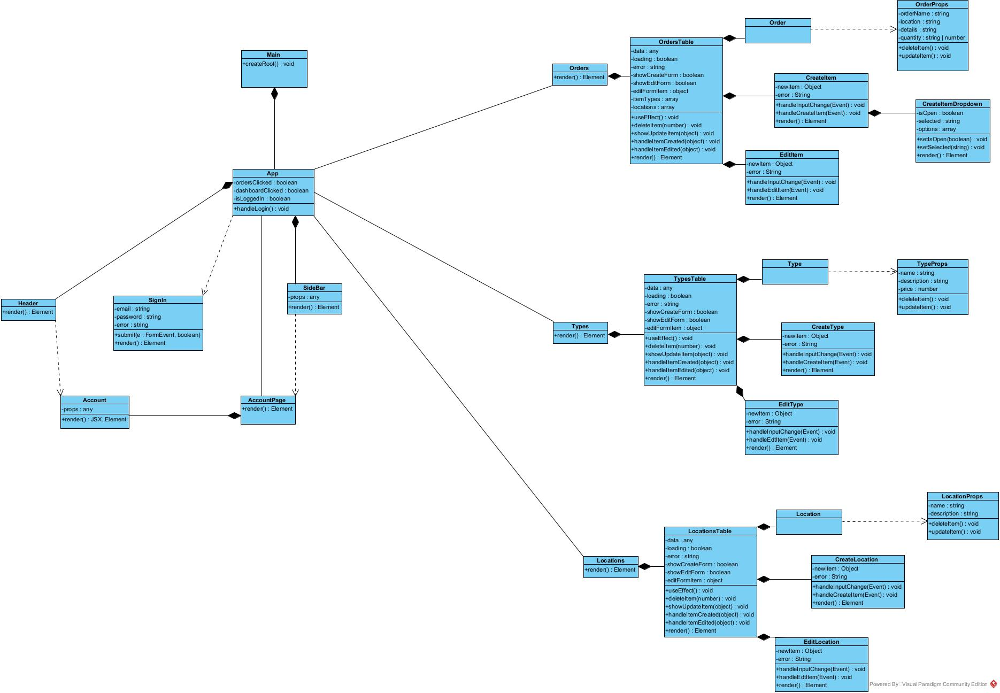

# UML Diagram

This section provides an overview of the **UML Class Diagram** for the Warehouse Management System, representing the relationships between different components, their attributes, and their interactions.

## Class Diagram Overview

The Warehouse Management System is structured into several key components, each handling specific functionalities related to **user authentication, inventory management, and warehouse operations**.

### Core Components

- **Main (`Main`)**: Initializes the application and sets up the root rendering.
- **Application State (`App`)**: Manages global states, such as navigation controls, user authentication, and dashboard interactions.
- **User Authentication (`SignIn`)**: Handles user login, form validation, and error management.
- **Navigation (`Header`, `Sidebar`)**: Provides the layout for accessing different sections of the system.
- **Account Management (`Account`, `AccountPage`)**: Displays user information and logout functionality.
- **Inventory Management (`Orders`, `OrdersTable`, `Order`)**: Facilitates tracking and modifying warehouse inventory.
- **Item Creation and Editing (`CreateItem`, `EditItem`, `CreateItemDropdown`)**: Allows users to add, modify, and categorize inventory items.
- **Item Type Management (`TypesTable`, `Type`, `CreateType`, `EditType`)**: Supports defining and managing different types of warehouse items.
- **Location Management (`LocationsTable`, `Location`, `CreateLocation`, `EditLocation`)**: Enables organization of inventory storage locations within the warehouse.

## Class Diagram Representation

Below is the **UML Class Diagram** illustrating the system's structure:

### Relationships and Data Flow

- The `Main` component initializes the system and connects to `App`, which maintains application-wide state.
- The `SignIn` component interacts with `App` to manage authentication.
- The `Sidebar` and `Header` components provide navigation to sections such as `Orders`, `TypesTable`, and `LocationsTable`.
- The `OrdersTable` component lists available inventory items, while `CreateItem` and `EditItem` allow for item modifications.
- The `TypesTable` and `LocationsTable` maintain categorized inventory and warehouse locations, respectively.
- Each entity manages its own **state and props**, ensuring dynamic interactivity within the UI.

This UML diagram provides a **comprehensive breakdown of the system architecture**, demonstrating how the different components interact to form a structured and efficient warehouse management interface.