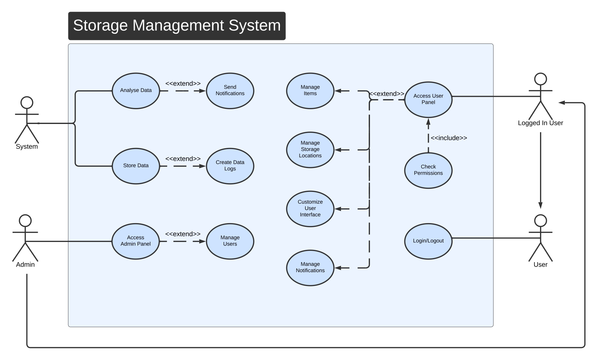

# Use Case Diagram

The **Warehouse Management System (WMS)** is designed to facilitate efficient management of storage locations, inventory, user roles, and system-wide interactions. This section presents the **Use Case Diagram**, which visually represents the interactions between different user roles and system functionalities.

## **Actors**
- **Admin**: Responsible for managing users, permissions, and system configurations.
- **Logged-in User**: Capable of handling inventory-related tasks, accessing user-specific features, and performing warehouse operations.
- **User**: Basic system users with limited functionalities such as viewing available data.

## **Use Cases**
1. **Login/Logout**: Users authenticate themselves and access the system.
2. **Manage Users**: Admin can create, modify, and delete user accounts.
3. **Manage Items**: Logged-in users can add, update, and remove inventory items.
4. **Manage Storage Locations**: Users can define, modify, and remove storage areas.
5. **Check Permissions**: Admin and logged-in users can verify access levels.
6. **Manage Notifications**: Users can send, receive, and configure system notifications.
7. **Customize User Interface**: Users can adjust the UI settings for personalized interaction.
8. **Access Admin Panel**: Admin can access a dashboard for system-wide control.
9. **Analyse Data**: Users can generate reports based on stored inventory information.
10. **Create and Store Data Logs**: System maintains records of all critical operations.

## **Use Case Diagram**
Below is the **visual representation** of the **Use Case Diagram** for the Warehouse Management System:

